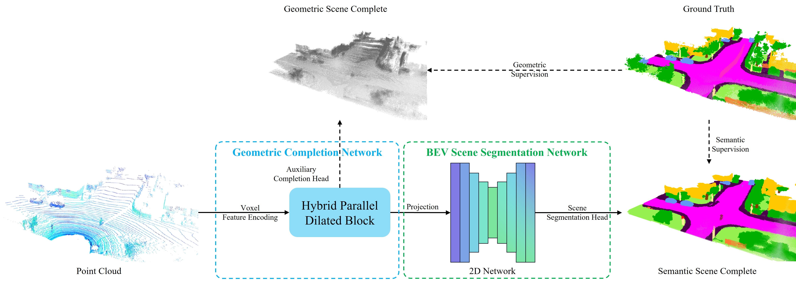
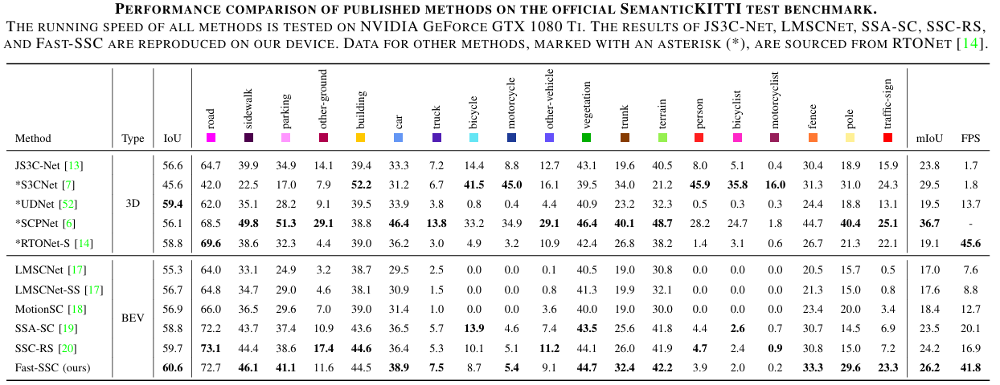

# Fast-SSC

## Fast Semantic Scene Completion via Two-stage Representation

This is the official implementation of Fast-SSC introduced in "Fast Semantic Scene Completion via Two-stage Representation" [[paper]](https://www.sciencedirect.com/science/article/pii/S0925231225019952).

If you find our work useful, please consider citing:

```bibtex
@article{Fast-SSC,
    title = {Fast semantic scene completion via two-stage representation},
    journal = {Neurocomputing},
    volume = {654},
    pages = {131323},
    year = {2025},
    issn = {0925-2312},
    doi = {https://doi.org/10.1016/j.neucom.2025.131323},
    url = {https://www.sciencedirect.com/science/article/pii/S0925231225019952},
    author = {Musen Lin and Wenguang Wang}
}
```

## Overview of Fast-SSC



## Performance of Fast-SSC



Among the BEV-based methods, Fast-SSC achieves top performance in semantic scene completion metrics. In particular, Fast-SSC significantly surpasses existing methods in terms of inference speed.

## Getting Started

### Environment

* PyTorch 2.1.0
* CUDA 11.8
* Python 3.8.18
* NumPy 1.23.5

### Clone the Repository

```bash
git clone https://github.com/six-wood/Fast-SSC.git
```

### Installation

Please install mmcv==2.1.0, mmdet==3.3.0, and torch_scatter==2.1.2 first. Then run the following command to install Fast-SSC.

```bash
pip install -v -e .
```

### Dataset

1. Download the Semantic Segmentation and Semantic Scene Completion datasets from the [SemanticKITTI website](http://www.semantic-kitti.org/dataset.html) and create a symbolic link using the following command.

    ```bash
    ln -s /path/to/semantickitti/dataset data/semantickitti
    ```

2. To speed up training, we merge the voxel labels (`.invalid`, `.label`, `.occluded`) into a single `.pkl` file per frame. Use the following command to generate these files. The `--rect_label` flag applies the label rectification algorithm introduced in [SCPNet](https://github.com/SCPNet/Codes-for-SCPNet).

    ```bash
    python projects/fssc/utils/semankitti/label/label_process.py --data_root=data/semantickitti --output=data/semantickitti --config_path=projects/fssc/utils/semankitti/label/semantic-kitti.yaml --rect_label(optional)
    ```

3. Generate the annotation information for the dataset using the following command.

    ```bash
    python projects/fssc/utils/semankitti/converter/create_data.py semantickitti --root-path data/semantickitti --out-dir data/semantickitti --extra-tag semantickittiDataset
    ```

The dataset folder should be organized as follows.

```
SemanticKITTI
├── dataset
│   ├── sequences
│   │  ├── 00
│   │  │  ├── labels
│   │  │  ├── velodyne
│   │  │  ├── voxels
│   │  │  ├── [OTHER FILES OR FOLDERS]
│   │  ├── 01
│   │  ├── ...
│   ├── ssc
│   │  ├── 00
│   │  │  ├── *.pkl
│   │  ├── 01
│   │  ├── ...
│   ├── semantickittiDataset_infos_train.pkl
│   ├── semantickittiDataset_infos_val.pkl
│   ├── semantickittiDataset_infos_test.pkl
```

## Pretrained Weights

We provide a better pretrained model weight trained on the train set of the SemanticKITTI dataset. You can download it from the following link.

| Model | Dataset | val mIoU | Download |
|-------|---------|:--------:|----------|
| Fast-SSC | SemanticKITTI | 27.1 | [Google Drive](https://drive.google.com/drive/folders/1zwsdGNKwtwJwrOE5n6n2riF8Tc8liLmQ?usp=drive_link) |

## Usage

We provide configuration files for training and testing in the `projects/fssc/config` folder. You can modify them to suit your needs.

Make sure to update the dataset path to your local dataset location in the configuration files before training.

Additionally, we recommend using [wandb](https://wandb.ai/site) for logging and monitoring the training process. You can create a free account and use the API key to log the training.

### Train Fast-SSC

```bash
cd <root dir of this repo>
bash tools/dist_train.sh projects/fssc/config/fssc-train.py 2
```

### Validation

```bash
cd <root dir of this repo>
python tools/test.py projects/fssc/config/fssc-val.py <path/to/model.pth>
```

### Test

```bash
cd <root dir of this repo>
bash tools/dist_test.sh projects/fssc/config/fssc-test.py <path/to/model.pth> 2
```

## Acknowledgement

This project would not be possible without the following great open-source codebases.

* [LMSCNet](https://github.com/cv-rits/LMSCNet)
* [SCPNet](https://github.com/SCPNet/Codes-for-SCPNet)
* [SSC-RS](https://github.com/Jieqianyu/SSC-RS)
* [SSA-SC](https://github.com/jokester-zzz/SSA-SC)
* [VoxFormer](https://github.com/NVlabs/VoxFormer)
* [MMDetection3D](https://github.com/open-mmlab/mmdetection3d)
