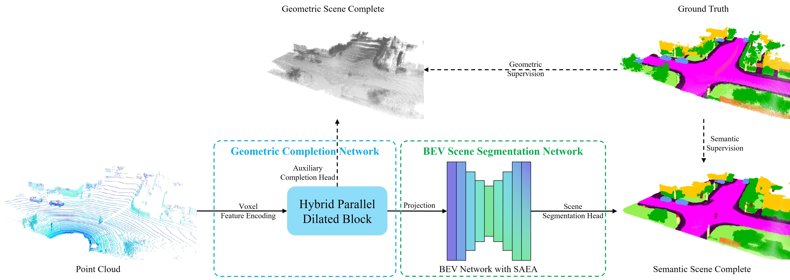
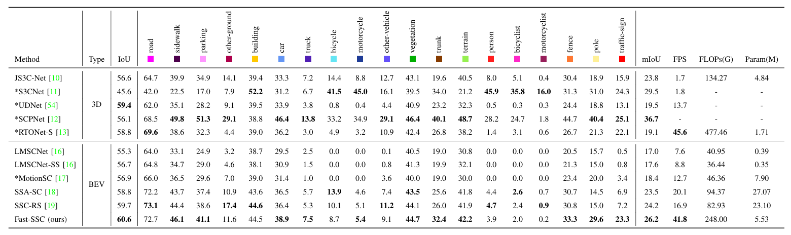

# Fast-SSC

## Fast Semantic Scene Completion via Two-stage Representation

This is the official implementation of Fast-SSC introduced in "Fast Semantic Scene Completion via Two-stage Representation" [[paper]](https://github.com/six-wood/Fast-SSC.git).

If you find our work useful, please cite this.

```bibtex
coming soon
```

## Overview of Fast-SSC



## Performance of Fast-SSC



Among the BEV-based methods, Fast-SSC achieves top performance in semantic scene completion metrics. Particularly in terms of running speed, Fast-SSC significantly surpasses existing methods.

## Getting Start

### Environment

* PyTorch 2.1.0
* CUDA 11.8
* Python 3.8.18
* Numpy 1.23.5

### Clone the repository

```bash
git clone https://github.com/six-wood/Fast-SSC.git
```

### Installation

Please install mmcv==2.1.0, mmdet==3.3.0 and torch_scatter=2.1.2 first. Then run the following command to install the Fast-SSC.

```bash
pip install -v -e .
```

### Dataset

1. Download Semantic Segmentation dataset and Semantic Scene Completion dataset from the [SemanticKITTI website](http://www.semantic-kitti.org/dataset.html) and link them by following commands.

    ```bash
    ln -s /path/to/semantic-kitti/dataset data/semantickitti
    ```

2. To speed up the training process, we merge the voxel labels (.invalid, .label, .occluded) into a single pkl file for each frame. You can use the following command to generate the pkl file. The parameter `--rect_label` uses the label rectification algorithm introduced in [SCPNet](https://github.com/SCPNet/Codes-for-SCPNet).

    ```bash
    python projects/fssc/utils/semankitti/label/label_process.py --data_root=data/semantickitti --output=data/semantickitti --config_path=utils/label/semantic-kitti.yaml --rect_label(optional)
    ```

3. Greate the annotation information for the dataset using following command.

    ```bash
    python projects/fssc/utils/semankitti/converter/create_data.py kitti --root-path data/semantickitti --out-dir data/semantickitti --extra-tag semantickittiDataset
    ```

The dataset folder should be organized as follows.

```angular2
SemanticKITTI
├── dataset
│   ├── sequences
│   │  ├── 00
│   │  │  ├── labels
│   │  │  ├── velodyne
│   │  │  ├── voxels
│   │  │  ├── [OTHER FILES OR FOLDERS]
│   │  ├── 01
│   │  ├── ... ...
│   ├── ssc
│   │  ├── 00
│   │  │  ├── *.pkl
│   │  ├── 01
│   │  ├── ... ...
│   ├──semantickittiDataset_infos_train.pkl
│   ├──semantickittiDataset_infos_val.pkl
│   ├──semantickittiDataset_infos_test.pkl
```

## Usage

We provide the configuration files for training and testing in the `projects/fssc/config` folder. You can change the configuration files to suit your needs.

Make sure to change the dataset path to your extracted dataset location in such files if you want to use them for training.

Additionally, we recommend using the wandb for logging and monitoring the training process. You can create a free account on [wandb](https://wandb.ai/site) and use the API key to log the training process.

### Train Fast-SSC

To train Fast-SSC, you can use the following command.

```bash
cd <root dir of this repo>
bash tools/dist_train.sh projects/fssc/config/fssc-train.py 2 
```

*To optimize memory usage during training, you can set with_cp=True in `projects/fssc/config/base/net.py` to utilize torch.utils.checkpoint in the training process.*

### Validation

```bash
cd <root dir of this repo>
python tools/test.py projects/fssc/config/fssc-val.py <path/to/model.pth>
```

### Test

```bash
cd <root dir of this repo>
bash tools/dist_test.sh projects/fssc/config/fssc-test.py <path/to/model.pth> 2
```

## Acknowledgement

This project is not possible without multiple great opensourced codebases.

* [LMSCNet](https://github.com/cv-rits/LMSCNet)
* [SCPNet](https://github.com/SCPNet/Codes-for-SCPNet)
* [SSC-RS](https://github.com/Jieqianyu/SSC-RS)
* [SSA-SC](https://github.com/jokester-zzz/SSA-SC)
* [VoxFormer](https://github.com/NVlabs/VoxFormer)
* [MMDetection3D](https://github.com/open-mmlab/mmdetection3d)
